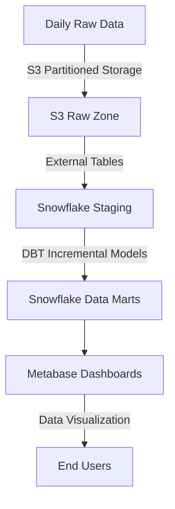

# OMS Pipeline Project [ELT]

## Overview
This project implements a cost-effective ELT pipeline designed for medium businesses, focusing on daily data processing with minimal impact on production systems. The pipeline extracts raw data, processes it incrementally, and stores it in a hybrid S3-Snowflake architecture for analytics and visualization.

## Key Features
* **Daily Incremental Processing**: Only processes new data each day, reducing compute costs and ensuring efficient resource utilization.

* **Cost-Optimized Storage**: Implements a hybrid approach using S3 for raw data storage and Snowflake for processed data, optimizing costs while maintaining performance.

* **Data Orchestration**: Leverages Apache Airflow for robust pipeline automation with scheduled workflows and dependency management.

* **Data Transformation**: Utilizes DBT for SQL transformations with incremental models, ensuring efficient and maintainable data processing.

* **Data Storage**: Implements a dual-storage strategy with AWS S3 for raw data and Snowflake for processed data, optimizing for both cost and performance.

* **Data Visualization**: Integrates Metabase for creating interactive dashboards connected directly to Snowflake.

* **Notifications**: Features comprehensive email alert system for pipeline status and failure monitoring.

* **Scalability**: Built with Docker containerization for seamless deployment and scaling.

## Architecture



## Tech Stack

### Core Components
* **Orchestration**: Apache Airflow
* **Data Transformation**: DBT (with incremental models)
* **Data Storage**:
  * Raw Data: AWS S3 (partitioned by date)
  * Processed Data: Snowflake (transient tables for staging)
* **Visualization**: Metabase
* **Programming**: Python (for Airflow tasks)
* **Containerization**: Docker
* **Infrastructure**: AWS EC2 (for Airflow and Metabase hosting)

## Installation

### Prerequisites
* Docker and Docker Compose installed
* AWS account with S3 and EC2 access
* Snowflake account with a configured warehouse
* Metabase instance (hosted or self-hosted)

### Setup Steps
1. Clone the repository:
```bash
git clone <repository_url>
cd <repository_name>
```

2. Build and run the Docker container:
```bash
docker-compose up --build
```

3. Configure Airflow connections:
   * AWS S3
   * Snowflake
   * Metabase

4. Access the pipeline:
   * Airflow: http://localhost:8080
   * Metabase: http://localhost:3000

## Workflow

### Daily Pipeline Execution

#### 1. Data Extraction
* Extract raw data from the source system
* Store in S3 with date-based partitioning:
```bash
s3://your-bucket/raw/year=YYYY/month=MM/day=DD/
```

#### 2. Data Loading
* Utilize Snowflake external tables to query raw data directly from S3
* Load only the previous day's data into a transient staging table

#### 3. Data Transformation
* Implement DBT incremental models to process and update intermediate/marts

#### 4. Visualization
* Create dashboards in Metabase using Snowflake marts
---
### Snowflake Optimization
* Implement transient tables for staging to reduce storage costs
* Enable auto-suspend for warehouses to minimize compute costs


## Deployment
* **Docker**: Containerized pipeline for consistent deployment
* **AWS EC2**: Dedicated hosting for Airflow and Metabase
* **Docker Hub**: Centralized image repository for team access

## License
This project is licensed under the MIT License. See the LICENSE file for details.
